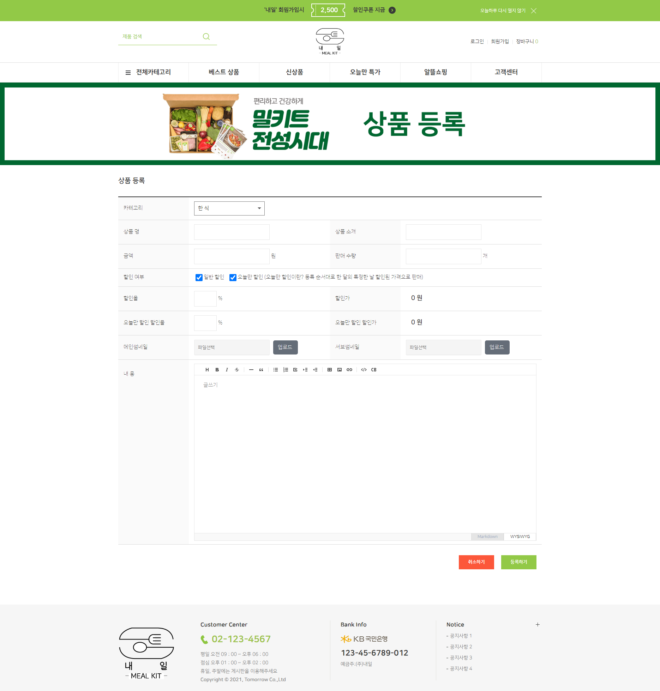
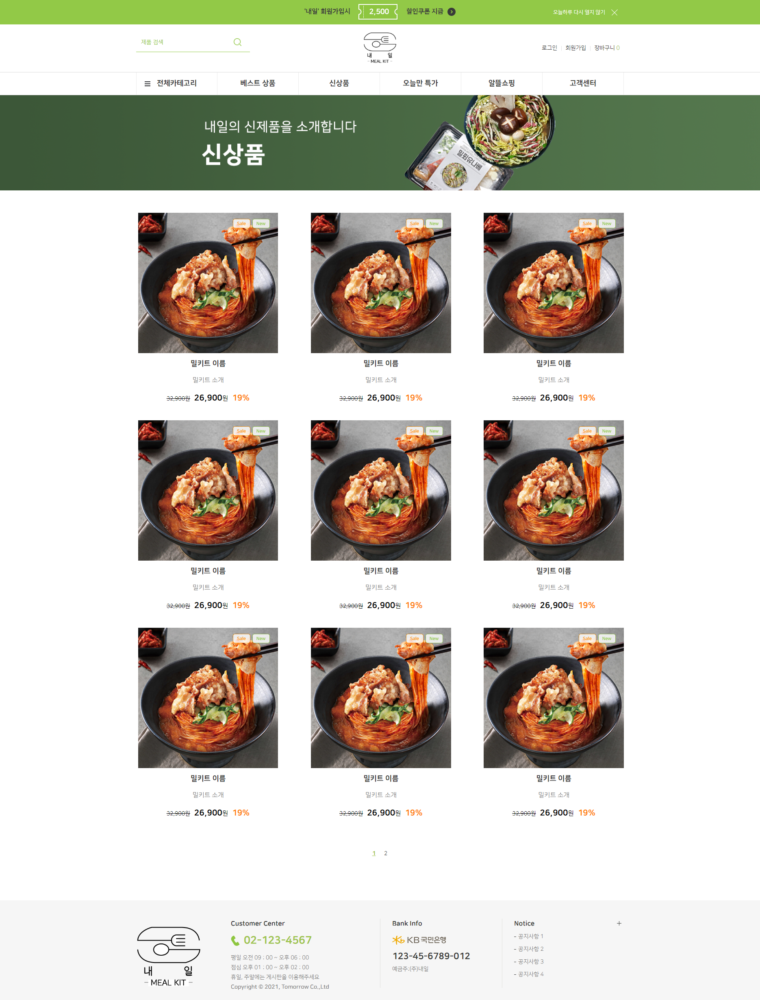
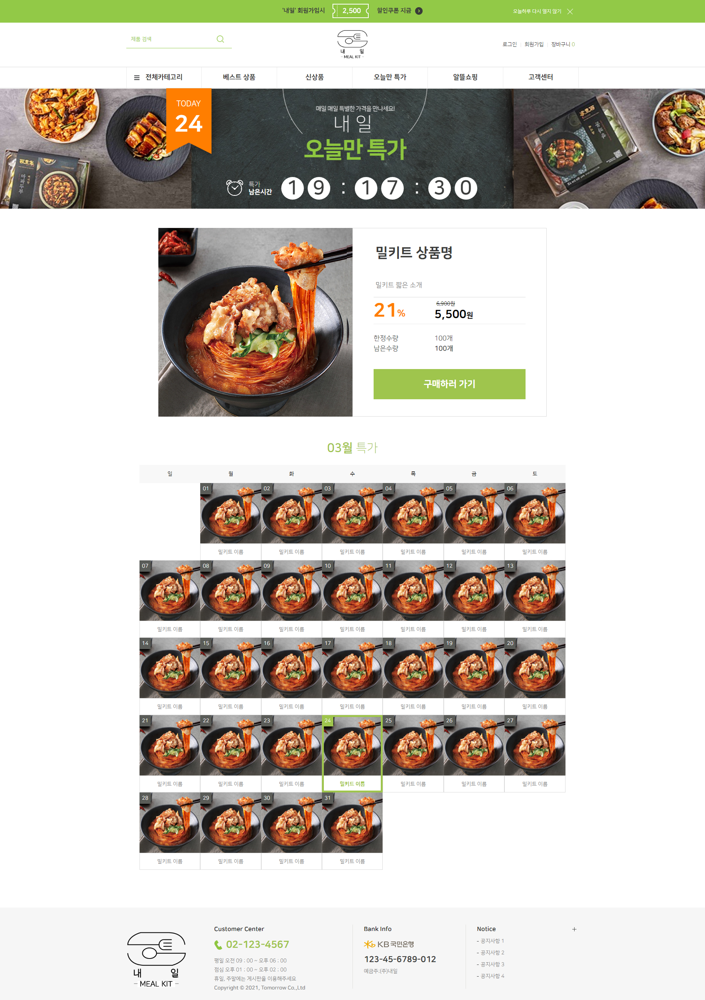
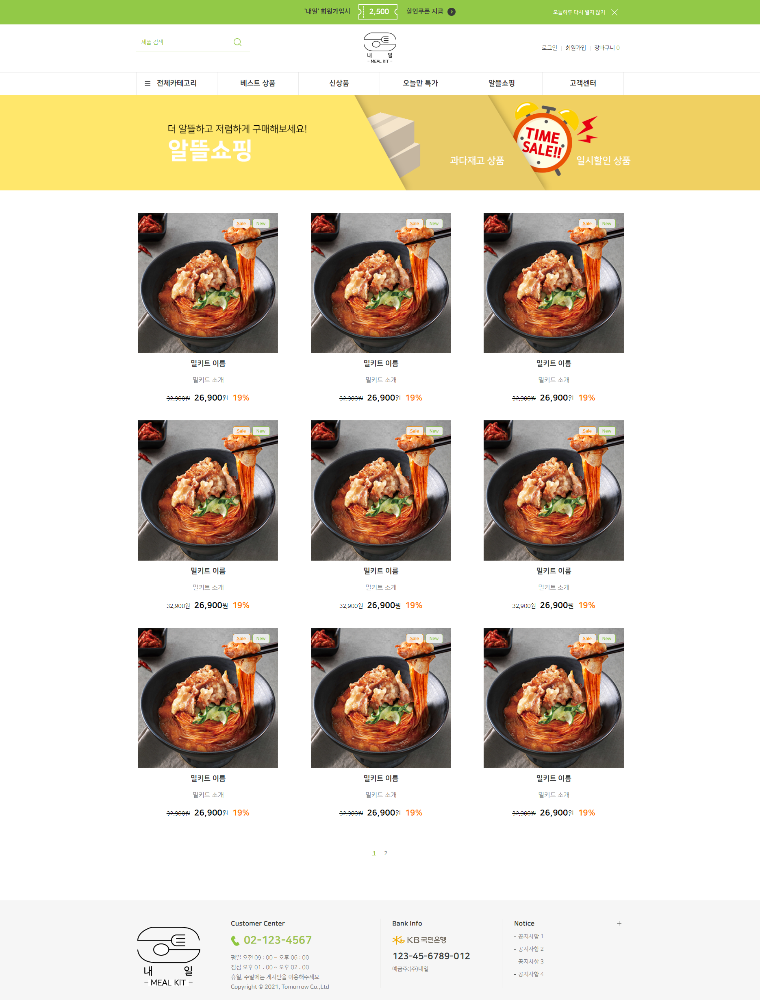

## 21-03-23 (화) 회의록

### 수정해야 할 것들
- DB
  * 테이블 이름 변경
    + 주문 상세 → 주문 상품
  * 정규화 작업
    + 외래 키를 제외한 데이터 삭제 작업(상품명, 가격 등)
  * 메뉴 테이블 추가 컬럼
    + 카테고리 추가 (한식 / 양식 / 중식,일식 / 면,파스타 / 분식,야식)

- 컨트롤러 부분
  * 메뉴 컨트롤러에서 이미지 등록 추가

- 프론트
  * 메뉴 이미지 등록 추가

### [와이어 프레임 Ver2](https://docs.google.com/spreadsheets/d/10SrKvuaMSS1o3AcKPkKHNrEf-KcOpHIv2pgsUF12sAQ/edit#gid=0)
#### 추가된 내용

> 상품 등록

> 베스트 상품

> 신상품

> 오늘만 특가

> 알뜰 쇼핑