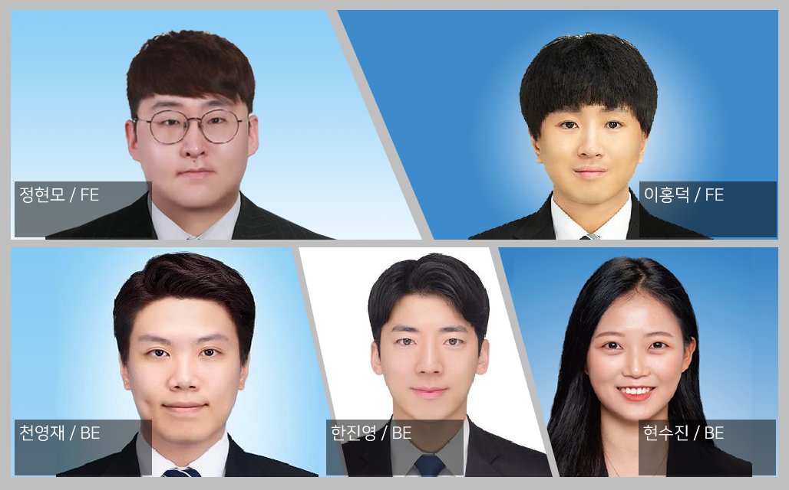
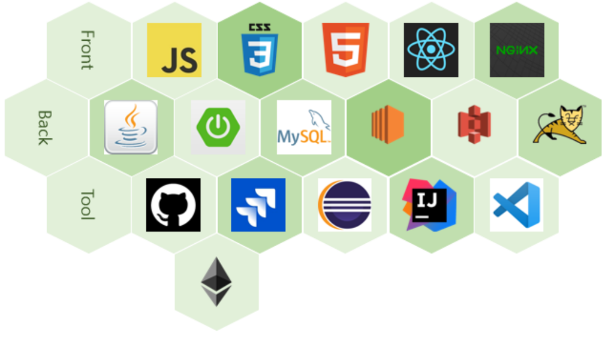

# Welcome to Tomorrow(내 일)

>Tomorrow 웹 로고

 

## 👩‍💻팀원소개

**Back-End**

- 한 진 영(Back-End), 천 영 재(Back-End), 현 수 진(Back-End)

**Front-End**

- 이 홍 덕(Front-End), 정 현 모(Front-End)

 

## 🎞 프로젝트 소개
- 밀키트 종합 판매 상거래 사이트
- 체험형부터 금식 지원 서비스까지 많은 형태의 밀키트가 나오고 있음에 따라 C2C 밀키트 쇼핑몰이 필요한 상태
- C2C 방식을 사용하여 밀키트 거래
- 블록체인을 이용한 안전거래 및 식품 안전 거래 서비스

## 🐱‍👤 주요 기능
- 상품 주문 시 판매자가 해당 상품 제조일 및 식품에 대한 정보 입력하여 블록체인에 등록
- 결제 시스템을 블록체인에 등록하여 불변성을 가진 투명한 결제 시스템
- C2C방식을 통해 유저간의 거래가 가능할 수 있도록 시스템 구성

## ✨ 기술 스택

